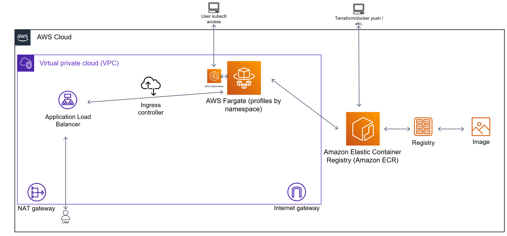

## Used tools

| Name | Version |
|------|---------|
| terraform | v1.7.1 |
| aws-cli | v2.17.20  |
| docker | v24.0.7 |
| kubectl | v1.27.2 |

# How to use this solution (AWS)
I was  not  able upload zip file du to unsupported format this is reason why Ive add my git repo URL
1. Download this repo https://github.com/silandrew/redcloudd.git.
2. Create an IAM user with an `AdministratorAccess` policy and access key (this is only for this homework; never do this in typical cases).
3. Configure your aws-cli to consume this IAM user with the `eu-west-2` region and the `default` profile.
3. cd to the `terraform` dir.
4. `terraform init` -> `terraform plan` -> `terraform apply`
6. Wait and relax. A good strong cuppa?
7. You can run, for example, the `watch kubectl get pods,ingress,hpa -n app-checkout` command. 
# Diagram

# General notes about the solution (AWS)

1. The entire solution is based on AWS cloud, where I used ECR for the private docker images registry, VPC for the networking layer, EKS for orchestration with Fargate profiles, IAM policies for some of the configuration and access profiles, and finally, helm to deploy the metrics server and ingress controller for ALB.
2. I used some Terraform modules prepared for AWS 
3. Outputs are only used for some bash scripts to speed up docker build/push and to edit k8s resources.
3. For the app,  should be build via gitlab pipe with Dockerfile.
6. I used Fargate profiles for flexibility and cost efficiency.
7. VPC is mostly private, but EKS access is open (you still need to authorize yourself). Of course, this is the same with potential ALB.
8. Three main Fargate profiles are provided—for the app, for the ingress and metrics, and for the system solutions (e.g., coredns).
9. The app is deployed as a simple K8s app with SVC, ingress (ALB), and a simple HPA profile.
10. I didn't use any Terraform state storage.
11. Due to some AWS limitations around Fargate and free accounts, sometimes nodes do not spin up in the first run. A higher quota can easily solve this, but I can't get it now. In this case, you can just rerun "terraform apply", and everything should be fine after.

# What should be done (AWS)

1. GitLab CI/CD or other solution to automate Docker image build, infra, and app deployment. 
app folder should be copy to gitlab repository and configure from pipelineGitLab variables for some non-sensitive data, separate jobs for steps, validation, and deployment via custom, small Docker images and outputs stored in the artifacts to grab them when needed and reuse them, for example, in other jobs.
2. Dynamic variables.
3. The app should probably be a Helm chart for easier deployment and to manage releases, rollbacks, and values more easily.
4. More granulated IAM policies.
8. Maybe the helm_release parts should be more part of the separate CI/CD. I don't like this in the IaC.
10. The proper Terraform state storage.
11.  certificate is includer in include the TLS certificate in your Docker image (for example, for local testing), follow these steps:

in  order to be able manag certificates in AWS we whould  use 
Step 1: Export the Certificate from ACM (Manual Step)
AWS Certificate Manager (ACM) does not directly support exporting private keys, so you would need to:

for testing certificate was manually sign a certificate using OpenSSL and use it in AWS, or
If using ACM-generated certificates, consider creating a certificate in a development tool like OpenSSL for testing purposes instead, as AWS does not permit exporting private keys for ACM certificates.
Full Ingress Configuration with HTTP to HTTPS Redirection
This configuration includes:

HTTPS only: The ALB will redirect HTTP requests to HTTPS.
SSL termination with ACM: SSL certificates managed by AWS ACM.
TLS configuration: Only serves traffic over HTTPS.

Certificates Management: Use ACM in AWS to manage and renew TLS certificates, ensuring HTTPS-only traffic.

This setup ensures the microservice meets security requirements, is containerized, and is accessible only over HTTPS through the reverse proxy. You are now ready for cloud deployment on ECS or EKS, managing certificates via ACM.

Testing the Service
Access HTTPS Endpoints:

https://hello-world.test.com/api/v1 should return "HELLO WORLd" with a 200 status.
https://hello-world.test.com/healthcheck should return "healthy" with a 200 status.
Verify HTTP Traffic is Blocked:

HTTP requests to http://hello-world.yourdomain.com should be redirected to HTTPS or blocked, depending on your Ingress configuration.

2. We can use Helm + ArgoCD for deployment to K8s. I didn't use it here because it would take a lot of time for a super simple app.
